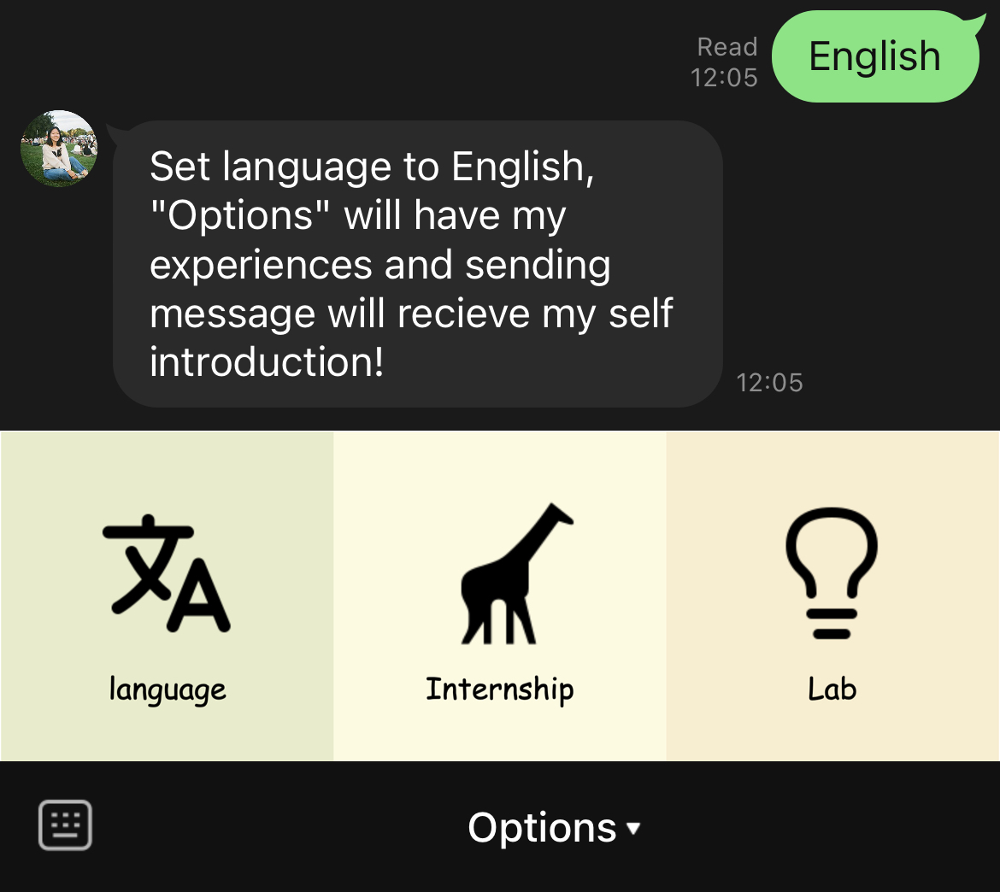

## Getting started

```
$ export LINE_CHANNEL_SECRET=YOUR_LINE_CHANNEL_SECRET
$ export LINE_CHANNEL_ACCESS_TOKEN=YOUR_LINE_CHANNEL_ACCESS_TOKEN
$ pip install -r requirements.txt
```

Start the server with
```
$ python app_with_handler.py --port [PORT]
```

## Add friend and start chatting

Please find `erina-line-qrcode.png` and add the chatbot as friend.

Once added, user can select a preferred language.


After the language is selected, the rich menu will pop up for use.



Tapping the "language" section can reset the preferred language, "Internship" and "Lab" section can know more about my experiences. Sending any text message will receive my self introduction!